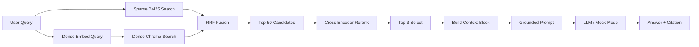

# Architecture — RAG Pipeline (Day 08 Lab)

## 1. Tổng quan kiến trúc

```
[Raw Docs]
    ↓
[index.py: Preprocess → Chunk → Embed → Store]
    ↓
[ChromaDB Vector Store]
    ↓
[rag_answer.py: Query → Retrieve → Rerank → Generate]
    ↓
[Grounded Answer + Citation]
```

**Mô tả ngắn gọn:**
Hệ thống là Trợ lý nội bộ CS + IT Helpdesk dùng để trả lời các câu hỏi về chính sách nội bộ của công ty (SLA xử lý ticket, hoàn tiền, cấp quyền, nghỉ phép, FAQ). Dự án này giải quyết bài toán tìm kiếm ngữ cảnh chính xác và sinh câu trả lời trung thực (grounded answer) có trích dẫn từ nguồn tài liệu chuẩn hóa.

---

## 2. Indexing Pipeline (Sprint 1)

### Tài liệu được index
| File | Nguồn | Department | Số chunk |
|------|-------|-----------|---------|
| `policy_refund_v4.txt` | policy/refund-v4.pdf | CS | 6 |
| `sla_p1_2026.txt` | support/sla-p1-2026.pdf | IT | 5 |
| `access_control_sop.txt` | it/access-control-sop.md | IT Security | 7 |
| `it_helpdesk_faq.txt` | support/helpdesk-faq.md | IT | 6 |
| `hr_leave_policy.txt` | hr/leave-policy-2026.pdf | HR | 5 |

### Quyết định chunking
| Tham số | Giá trị | Lý do |
|---------|---------|-------|
| Chunk size | 400 tokens (~1600 chars) | Đủ rộng để bao phủ trọn vẹn một điều khoản chính sách mà không làm loãng ngữ cảnh. |
| Overlap | 80 tokens (~320 chars) | Đảm bảo tính liên kết ngữ cảnh giữa các đoạn liền kề. |
| Chunking strategy | Paragraph-based with Section splits | Cắt nhỏ tài liệu dựa trên tiêu đề phần (`=== Section ===`) và ghép các đoạn (`\n\n`) để không cắt đôi câu làm mất nghĩa. |
| Metadata fields | source, section, effective_date, department, access | Phục vụ bộ lọc tìm kiếm, kiểm tra độ mới của tài liệu và trích dẫn trực tiếp nguồn. |

### Embedding model
- **Model**: `all-MiniLM-L6-v2` (Sentence Transformers local)
- **Vector store**: ChromaDB (PersistentClient)
- **Similarity metric**: Cosine Similarity

---

## 3. Retrieval Pipeline (Sprint 2 + 3)

### Baseline (Sprint 2)
| Tham số | Giá trị |
|---------|---------|
| Strategy | Dense (embedding similarity) |
| Top-k search | 10 |
| Top-k select | 3 |
| Rerank | Không |

### Variant (Sprint 3)
| Tham số | Giá trị | Thay đổi so với baseline |
|---------|---------|------------------------|
| Strategy | Hybrid (Dense + BM25) | Kết hợp tìm kiếm ngữ nghĩa Dense và từ khóa chính xác Sparse bằng RRF. |
| Top-k search | 50 candidates | Tăng số ứng viên ban đầu trước khi Rerank để tăng recall. |
| Top-k select | 3 | Số chunk đưa vào prompt tối ưu không đổi. |
| Rerank | Cross-Encoder `ms-marco-MiniLM-L-6-v2` | Chấm lại mức độ liên quan thực tế giữa query và chunk. |
| Query transform | Không | Giữ nguyên query để so sánh A/B công bằng. |

**Lý do chọn variant này:**
Corpus bao gồm cả ngôn ngữ tự nhiên (chính sách nhân sự, hoàn tiền) và các tên riêng, mã lỗi, thuật ngữ đặc biệt (ví dụ: P1 ticket, ERR-403, SLA, Access Control SOP). Việc dùng Hybrid (Dense + BM25) giúp bắt tốt cả từ đồng nghĩa và từ khóa đặc thù chính xác. Rerank bằng Cross-Encoder giúp lọc đi các chunk gây nhiễu tốt nhất.

---

## 4. Generation (Sprint 2)

### Grounded Prompt Template
```
Answer only from the retrieved context below.
If the context is insufficient to answer the question, say you do not know and do not make up information.
Cite the source field (in brackets like [1]) when possible.
Keep your answer short, clear, and factual.
Respond in the same language as the question.

Question: {query}

Context:
{context_block}

Answer:
```

### LLM Configuration
| Tham số | Giá trị |
|---------|---------|
| Model | `gpt-4o-mini` / `gemini-1.5-flash` (và fallback mock local) |
| Temperature | 0 (để câu trả lời ổn định cho đánh giá) |
| Max tokens | 512 |

---

## 5. Failure Mode Checklist

| Failure Mode | Triệu chứng | Cách kiểm tra |
|-------------|-------------|---------------|
| Index lỗi | Retrieve về docs cũ / sai version | `inspect_metadata_coverage()` trong index.py |
| Chunking tệ | Chunk cắt giữa điều khoản | `list_chunks()` và đọc text preview |
| Retrieval lỗi | Không tìm được expected source | `score_context_recall()` trong eval.py |
| Generation lỗi | Answer không grounded / bịa | `score_faithfulness()` trong eval.py |
| Token overload | Context quá dài → lost in the middle | Kiểm tra độ dài context_block |

---

## 6. Diagram


