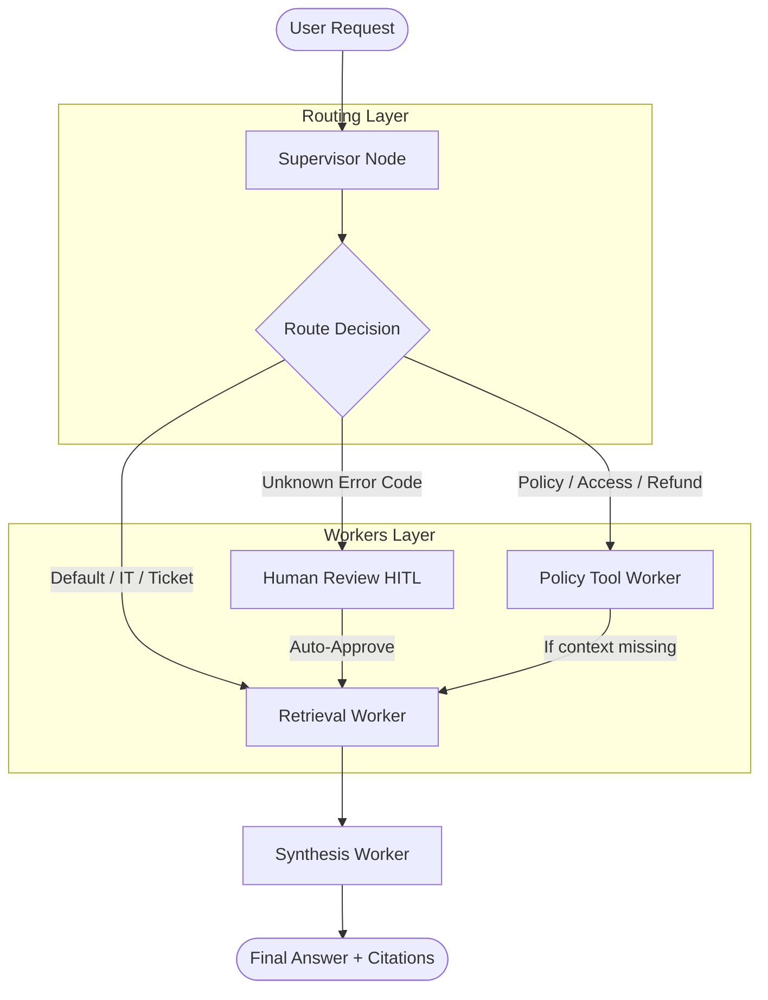

# System Architecture — Lab Day 09

**Nhóm:** VinAI Lab Team  
**Ngày:** 2026-06-10  
**Version:** 1.0

---

## 1. Tổng quan kiến trúc

**Pattern đã chọn:** Supervisor-Worker  
**Lý do chọn pattern này (thay vì single agent):**
Tách biệt các vai trò giúp hệ thống linh hoạt hơn. Thay vì bắt một Agent duy nhất (Single Agent) vừa thực hiện tìm kiếm tài liệu (retrieval), vừa phải tự suy luận phân tích chính sách phức tạp và phát hiện ngoại lệ, cấu trúc Supervisor-Worker phân rã bài toán thành các Worker chuyên biệt. Supervisor đóng vai trò điều phối, phân luồng yêu cầu dựa vào nội dung câu hỏi và mức độ rủi ro, giúp dễ dàng kiểm thử, tối ưu hóa từng phần (như thay đổi mô hình embedding hoặc cải tiến logic check policy) mà không ảnh hưởng đến toàn bộ hệ thống. Ngoài ra, việc lưu trữ log hoạt động của từng worker dưới dạng State giúp tăng khả năng quan sát (observability) và debug.

---

## 2. Sơ đồ Pipeline

**Sơ đồ thực tế của nhóm:**

---

## 3. Vai trò từng thành phần

### Supervisor (`graph.py`)

| Thuộc tính | Mô tả |
|-----------|-------|
| **Nhiệm vụ** | Phân tích câu hỏi người dùng, quyết định route sang worker phù hợp, gán cờ rủi ro (risk_high) và cờ cần công cụ (needs_tool). |
| **Input** | `task` (str) |
| **Output** | `supervisor_route`, `route_reason`, `risk_high`, `needs_tool` |
| **Routing logic** | Sử dụng keyword matching:  - Chứa từ khóa hoàn tiền, refund, flash sale, license, cấp quyền, access, level 3 -> route sang `policy_tool_worker` và bật `needs_tool`.  - Chứa từ khóa emergency, khẩn cấp, 2am, err- -> bật cờ `risk_high`.  - Chứa mã lỗi không rõ `err-` kết hợp với `risk_high` -> route sang `human_review`.  - Các case còn lại -> route sang `retrieval_worker`. |
| **HITL condition** | Khi có cờ `risk_high` kết hợp với mã lỗi không xác định (`err-` trong câu hỏi). |

### Retrieval Worker (`workers/retrieval.py`)

| Thuộc tính | Mô tả |
|-----------|-------|
| **Nhiệm vụ** | Thực hiện dense semantic search trên ChromaDB collection `day09_docs` dựa trên câu hỏi của người dùng. |
| **Embedding model** | `all-MiniLM-L6-v2` (SentenceTransformer chạy local) |
| **Top-k** | 3 |
| **Stateless?** | Yes |

### Policy Tool Worker (`workers/policy_tool.py`)

| Thuộc tính | Mô tả |
|-----------|-------|
| **Nhiệm vụ** | Phân tích chính sách dựa trên các chunks và câu hỏi để phát hiện ngoại lệ (exceptions) và gọi các MCP tools khi cần thiết. |
| **MCP tools gọi** | `search_kb`, `get_ticket_info` |
| **Exception cases xử lý** | - Đơn hàng Flash Sale không hoàn tiền (Điều 3). - Sản phẩm kỹ thuật số (license key, subscription) không hoàn tiền. - Sản phẩm đã kích hoạt hoặc sử dụng không hoàn tiền. - Temporal Scoping: Check đơn hàng trước ngày 01/02/2026 (áp dụng policy v3 thay vì v4). |

### Synthesis Worker (`workers/synthesis.py`)

| Thuộc tính | Mô tả |
|-----------|-------|
| **LLM model** | Gemini/OpenAI (Mock mode fallback nếu không cấu hình API Key) |
| **Temperature** | 0.1 (để đảm bảo tính nhất quán và chặt chẽ) |
| **Grounding strategy** | Sử dụng System Prompt nghiêm ngặt yêu cầu trích dẫn nguồn dạng `[tên_file]` ở cuối câu và chỉ sử dụng context được cung cấp. |
| **Abstain condition** | Nếu context không đủ hoặc câu hỏi về mã lỗi chưa có tài liệu -> trả về "Không đủ thông tin trong tài liệu nội bộ." |

### MCP Server (`mcp_server.py`)

| Tool | Input | Output |
|------|-------|--------|
| `search_kb` | query (str), top_k (int) | chunks (list), sources (list), total_found (int) |
| `get_ticket_info` | ticket_id (str) | ticket details (dict: status, priority, assignee, SLA, v.v.) |
| `check_access_permission` | access_level (int), requester_role (str), is_emergency (bool) | can_grant (bool), required_approvers (list), emergency_override (bool), notes (list), source (str) |
| `create_ticket` | priority (str), title (str), description (str) | ticket_id (str), url (str), created_at (str) |

---

## 4. Shared State Schema

| Field | Type | Mô tả | Ai đọc/ghi |
|-------|------|-------|-----------|
| `task` | str | Câu hỏi đầu vào của người dùng | Ghi: Khởi tạo; Đọc: Supervisor, Workers |
| `supervisor_route` | str | Worker tiếp theo được chọn | Ghi: Supervisor, Human Review; Đọc: Router |
| `route_reason` | str | Lý do lựa chọn route | Ghi: Supervisor; Đọc: Synthesis, Log |
| `risk_high` | bool | Gắn cờ câu hỏi có rủi ro cao | Ghi: Supervisor; Đọc: Log |
| `needs_tool` | bool | Cần gọi MCP Tool | Ghi: Supervisor; Đọc: Policy Tool |
| `hitl_triggered` | bool | Cờ đánh dấu đã đi qua Human Review | Ghi: Human Review; Đọc: Log |
| `retrieved_chunks` | list | Các document chunks tìm được | Ghi: Retrieval Worker, MCP search_kb; Đọc: Policy Tool, Synthesis |
| `retrieved_sources` | list | Danh sách file nguồn tài liệu | Ghi: Retrieval Worker; Đọc: Synthesis |
| `policy_result` | dict | Kết quả phân tích policy | Ghi: Policy Tool; Đọc: Synthesis |
| `mcp_tools_used` | list | Danh sách các tool call đã thực hiện qua MCP | Ghi: Policy Tool; Đọc: Log |
| `final_answer` | str | Câu trả lời tổng hợp cuối cùng | Ghi: Synthesis Worker; Đọc: Output |
| `confidence` | float | Điểm số tin cậy tự đánh giá (0.0 - 1.0) | Ghi: Synthesis Worker; Đọc: Output |
| `history` | list | Lịch sử vết chạy của các bước trong graph | Ghi: Tất cả các nodes; Đọc: Log |
| `workers_called` | list | Danh sách các worker đã được thực thi | Ghi: Tất cả các nodes; Đọc: Log |
| `latency_ms` | int | Tổng thời gian thực thi của đồ thị | Ghi: Graph runner; Đọc: Log |
| `run_id` | str | ID duy nhất của run (kèm microsecond) | Ghi: Khởi tạo; Đọc: Log writer |

---

## 5. Lý do chọn Supervisor-Worker so với Single Agent (Day 08)

| Tiêu chí | Single Agent (Day 08) | Supervisor-Worker (Day 09) |
|----------|----------------------|--------------------------|
| Debug khi sai | Khó — không rõ lỗi ở đâu | Dễ hơn — test từng worker độc lập |
| Thêm capability mới | Phải sửa toàn bộ prompt lớn | Thêm worker mới hoặc tích hợp MCP tool riêng biệt |
| Routing visibility | Không có | Có cờ `supervisor_route` và `route_reason` rõ ràng trong trace |
| Phân chia nghiệp vụ | Gộp chung suy luận và tìm kiếm | Phân rã luồng xử lý: kiểm tra điều kiện ngoại lệ rồi mới tổng hợp |

**Nhận xét từ thực tế lab:**
Trong quá trình chạy thử nghiệm 15 câu hỏi, cấu trúc Multi-Agent giúp xử lý cực kỳ tốt các câu hỏi dạng multi-hop đòi hỏi kết hợp dữ liệu từ nhiều nguồn khác nhau (như ticket P1 tạo lúc 22:47 kết hợp với file chính sách SLA) nhờ vào việc Supervisor route chính xác sang Policy/Retrieval Worker và thu thập đủ context trước khi đưa qua Synthesis.

---

## 6. Giới hạn và điểm cần cải tiến

1. **Routing Layer còn thô sơ:** Hiện tại Supervisor sử dụng cơ chế so khớp từ khóa (keyword matching). Khi câu hỏi phức tạp hơn hoặc có từ khóa trùng lặp giữa các domain, Supervisor có thể route nhầm. Cần cải tiến sang LLM classifier (như gpt-4o-mini hoặc gemini-1.5-flash) với prompt phân loại hoặc sử dụng mô hình phân loại cục bộ.
2. **HITL (Human in the loop) chưa thực tế:** Node `human_review` mới chỉ chạy ở chế độ tự động phê duyệt (auto-approve) để phục vụ chạy test hàng loạt. Cần tích hợp cơ chế ngắt đồ thị (LangGraph interrupt) để người dùng thực sự can thiệp từ giao diện điều khiển.
3. **Chưa xử lý vòng lặp lỗi:** Nếu Synthesis Worker nhận diện context vẫn thiếu để trả lời câu hỏi nhưng Supervisor cho rằng đã route đúng, hệ thống sẽ trả lời "Không đủ thông tin". Cần thêm một feedback loop để Synthesis có thể yêu cầu Supervisor route lại hoặc tăng `top_k`.
