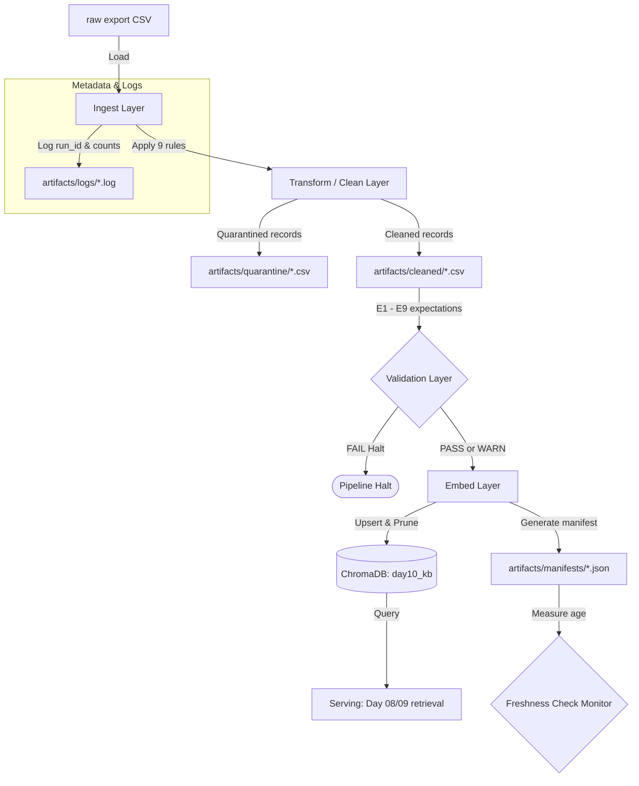

# Kiến trúc pipeline — Lab Day 10

**Nhóm:** VinAI Lab Team  
**Cập nhật:** 2026-06-10

---

## 1. Sơ đồ luồng (bắt buộc có 1 diagram: Mermaid / ASCII)

---

## 2. Ranh giới trách nhiệm

| Thành phần | Input | Output | Owner nhóm |
|------------|-------|--------|--------------|
| Ingest | `data/raw/policy_export_dirty.csv` | List of dict rows | Nguyen Van A |
| Transform | raw rows, allowlist, regex | cleaned rows, quarantined rows | Tran Van B |
| Quality | cleaned rows, rules (halt/warn) | Validation results (Passed/Failed) | Pham Van C |
| Embed | cleaned CSV file | Chroma vector entries updated, pruned | Nguyen Van A |
| Monitor | manifest JSON file | SLA Freshness check output | Le Thi D |

---

## 3. Idempotency & rerun

- **Strategy:** Pipeline sử dụng hàm sinh hash `_stable_chunk_id(doc_id, chunk_text, seq)` để sinh `chunk_id` duy nhất dựa trên metadata của tài liệu và nội dung chunk.
- **Idempotency:** Khi chạy lại (rerun) cùng một bộ dữ liệu nhiều lần, ChromaDB `col.upsert` sẽ ghi đè (update) các bản ghi có cùng `chunk_id` thay vì chèn mới, đảm bảo số lượng vector trong collection không thay đổi và không bị trùng lặp.
- **Pruning:** Để tránh dữ liệu cũ (stale) vẫn tồn tại dưới các ID cũ, pipeline có cơ chế so sánh `ids` hiện tại với toàn bộ `ids` đang có trong vector store, sau đó gọi `col.delete` để prune (xóa bỏ) các vector mồ côi.

---

## 4. Liên hệ Day 09

- **Nguồn cấp tài liệu:** Pipeline Ingestion ở Day 10 làm sạch các file xuất thô từ DB/API (các cột text và metadata) rồi ghi đè lên ChromaDB collection (`day10_kb` hoặc collection chung).
- **Cải tiến:** So với Day 09 (nơi chúng ta parser trực tiếp từ file văn bản thô trong `data/docs`), ở Day 10 chúng ta có tầng kiểm soát chất lượng (quarantine + expectations) trước khi dữ liệu được nạp vào Vector Store. Điều này giúp ngăn chặn các chunk hỏng, stale, hoặc trùng lặp lọt vào RAG pipeline của Agent, nâng cao độ chính xác của câu trả lời.

---

## 5. Rủi ro đã biết

- **Lệ lệch ID tuần tự (Sequence Shift):** Việc sử dụng `seq` để sinh `chunk_id` có thể làm ID của một chunk thay đổi nếu thứ tự dòng trong CSV bị xáo trộn hoặc các dòng trước đó bị quarantine. Cơ chế prune đã giải quyết việc dọn dẹp vector mồ côi, nhưng có thể tăng overhead nạp lại.
- **Đồng bộ Schema:** Nếu định dạng CSV thô thay đổi (ví dụ: thêm cột mới hoặc đổi tên cột), Ingest Layer sẽ bị lỗi. Cần có cơ chế kiểm tra schema thô (schema validation) trước khi clean.
- **Lệch múi giờ:** Việc so sánh `exported_at` với giờ hiện tại của hệ thống để đo Freshness có thể bị fail (SLA Exceeded) nếu múi giờ không đồng nhất (UTC vs Local).
